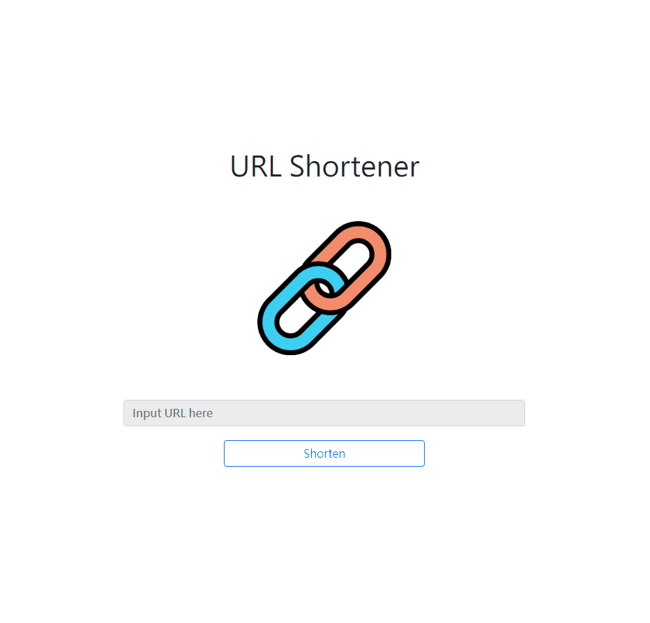

<a name="readme-top"></a>

<!-- PROJECT LOGO -->
<div align="center">
  <a href="https://github.com/CYW-Allen/restaurant-list">
    
  </a>

  <h1 align="center">URL Shortener</h1>
  <h3 align="center">An express app for shortening the url</h3>
</div>


<!-- TABLE OF CONTENTS -->
<details>
  <summary>Table of Contents</summary>
  <ol>
    <li>
      <a href="#about-the-project">About The Project</a>
      <ul>
        <li><a href="#main-function">Main Function</a></li>
        <li><a href="#additional-modifications">Additional Modifications</a></li>
        <li><a href="#built-with">Built With</a></li>
      </ul>
    </li>
    <li><a href="#getting-started">Getting Started</a></li>
  </ol>
</details>


<!-- ABOUT THE PROJECT -->
## About The Project

<div align="center">
  
</div>

### Main Function
* Generate one shortened url.

### Additional modifications
* Add one button for back to the frontpage.
* Error handling with the error page.

### Built With

* [![Express][Express.js]][Express-url]
* [![Bootstrap][Bootstrap.com]][Bootstrap-url]

<p align="right">(<a href="#readme-top">back to top</a>)</p>


<!-- GETTING STARTED -->
## Getting Started

### Installation

1. Clone the repo
   ```sh
   git clone https://github.com/CYW-Allen/url-shortener.git
   ```
2. Install NPM packages
   ```sh
   npm install
   ```

After the installation, now you can run the app by the following command.
  ```sh
  npm start
  ```

<p align="right">(<a href="#readme-top">back to top</a>)</p>


<!-- MARKDOWN LINKS & IMAGES -->
<!-- https://www.markdownguide.org/basic-syntax/#reference-style-links -->
[Express.js]: https://img.shields.io/badge/Express.js-rgb(194%2C%20234%2C%20255)?style=for-the-badge&logo=nodedotjs&logoColor=green
[Express-url]: https://expressjs.com/
[Bootstrap.com]: https://img.shields.io/badge/Bootstrap-563D7C?style=for-the-badge&logo=bootstrap&logoColor=white
[Bootstrap-url]: https://getbootstrap.com
